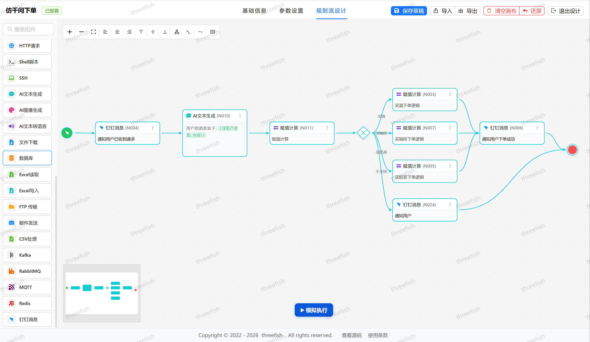
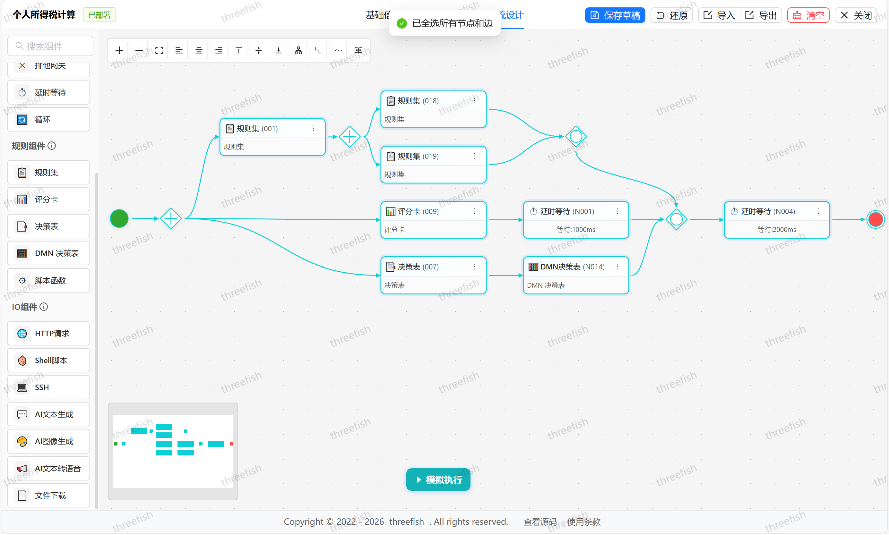
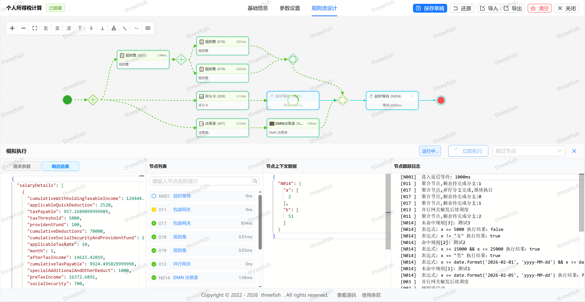
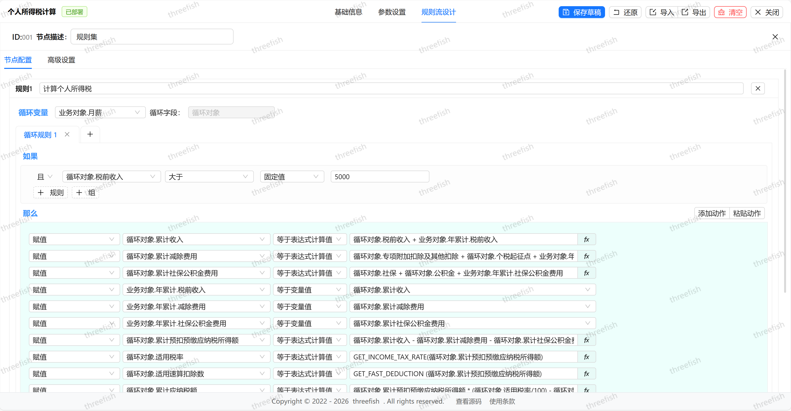
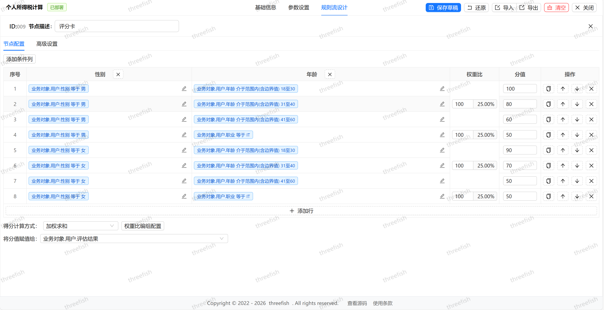
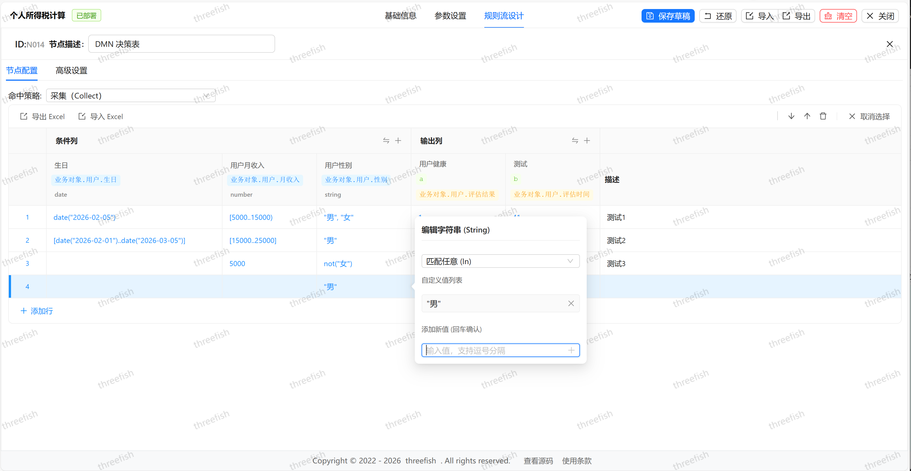
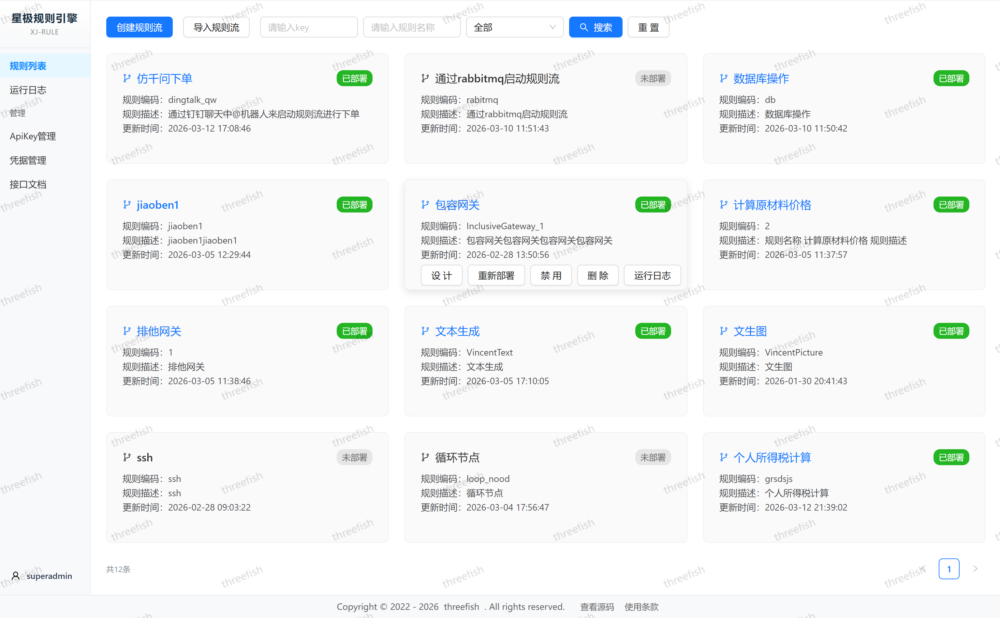
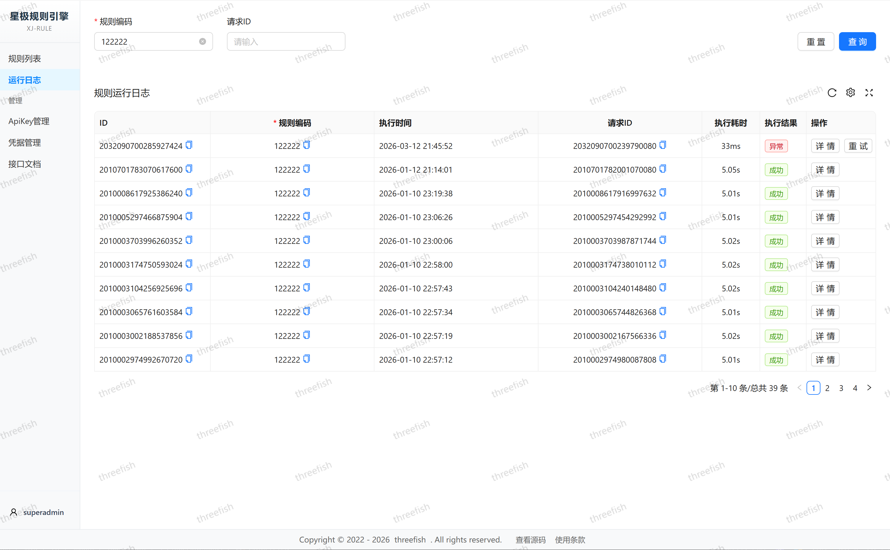
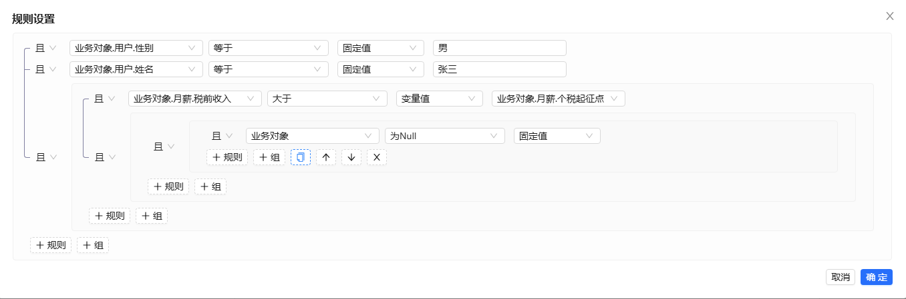
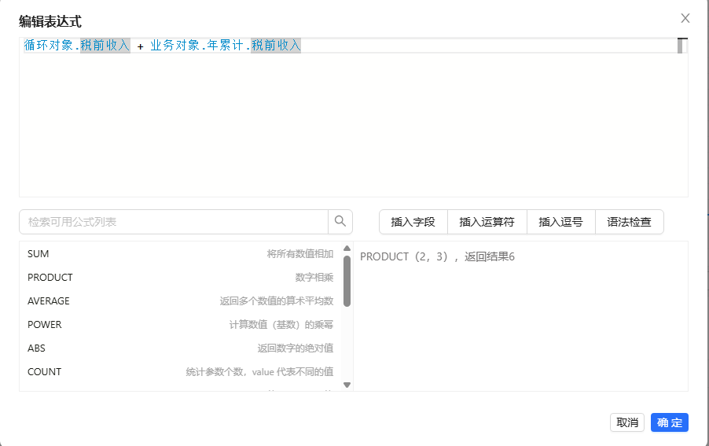

# Rule Engine

🔥 **High-performance, High-concurrency, Visualized Enterprise-level Rule Engine System** 🔥

A flexible and powerful rule engine built on Java, Akka Actor model, and Aviator expression engine, focusing on complex business rule definition, combination, and execution in high-concurrency scenarios, providing enterprises with fast decision-making and elastic scheduling capabilities.

[](https://github.com/threefish/rule-engine)
[](https://github.com/threefish/rule-engine)
[](https://github.com/threefish/rule-engine/blob/main/LICENSE)

English | [简体中文](README_ZH.md)

**[Frontend Source Code](https://github.com/threefish/rule-engine-web)**

## 🎯 Core Advantages

- **🚀 High Performance**: Based on Akka Actor model for high concurrency design, supporting large-scale rule parallel execution
- **🎨 Visualization**: Provides intuitive rule definition and process orchestration interface, lowering the threshold for business personnel
- **⚡ High Flexibility**: Supports complex rule condition combinations and multiple operators, adapting to various business scenarios
- **🔄 High Reliability**: Complete error handling and automatic retry mechanism to ensure the reliability of rule execution
- **📊 Monitorable**: Detailed execution logs and monitoring mechanisms for easy problem locating and performance optimization
- **🔧 Easy to Extend**: Modular design, supporting custom extensions and secondary development

## ✨ Project Features

- **Core Scheduling: Based on Akka Actor Model**: Utilizes Akka's high concurrency, asynchronous, and fault-tolerant capabilities to achieve flexible scheduling of parallel, branch, and aggregation between rule flow nodes
- **Expression Core: Based on Aviator Engine**: Provides high-performance expression parsing and execution, supporting complex logical calculations
- **Flexible Rule Definition**: Supports multiple operators, combination methods, and condition types
- **Process-driven**: Orchestrates the logic and order of rule execution based on process models
- **Automatic Retry Mechanism**: Supports configurable automatic retry strategies when node execution fails
- **Thread-safe Context Management**: Achieves safe data sharing between nodes through FlowContext
- **Support for Synchronous and Asynchronous Execution**: Can flexibly choose execution mode according to business needs
- **Complete Rule Execution Logs**: Detailed records of rule execution process and results, facilitating auditing and debugging

## 🏗️ Project Structure

### Technology Stack


| Technology      | Version | Purpose                                                  |
| --------------- | ------- | -------------------------------------------------------- |
| Java            | 1.8     | Main development language                                |
| Spring Boot     | 3.5.7   | Service framework                                        |
| Akka            | 2.6.20  | Actor model for high concurrency process scheduling      |
| Aviator         | 5.3.3   | High-performance expression parsing and execution engine |
| Quartz          | 2.5.0   | Scheduled task framework                                 |
| Spring Data JPA | 3.5.7   | Persistence framework                                    |
| MySQL           | 8.0.33  | Database                                                 |
| Hutool          | 5.7.18  | Java tool library                                        |
| Lombok          | 1.18.42 | Simplify Java code                                       |

### Overall Architecture

```
rule-engine/
├── engine/             # Rule engine core module
│   ├── common/         # Common tools and constants
│   ├── custom/         # Custom services
│   ├── dto/            # Data transfer objects
│   ├── engine/         # Engine core implementation
│   │   ├── aviator/    # Aviator expression executor
│   │   ├── rule/       # Rule definition
│   │   └── runtime/    # Runtime services
│   ├── event/          # Event definition
│   └── exception/      # Exception definition
└── service/            # Rule engine service module
    ├── api/            # API interface definition
    ├── config/         # Configuration classes
    ├── job/            # Dynamic tasks
    ├── listener/       # Listeners
    ├── node/           # Node-related definitions
    ├── repository/     # Data access layer
    ├── runner/         # Startup loaders
    ├── service/        # Business service implementation
    └── utils/          # Utility classes
```

## 🔄 Rule Engine Workflow

1. **Rule Definition**: Create rule objects, set conditions and operators
2. **Process Construction**: Define process models, orchestrate serial, parallel, branch, and aggregation logic through gateway nodes
3. **Process Execution**: Call RuleFlowExcuteService to start process instances
4. **Actor Scheduling**: AkkaRuleFlowScheduler creates Actors to control the process
5. **Node Execution**: Schedule NodeWorkerActor to execute each node
6. **Dependency Handling**: Manage dependencies between nodes through NodeDependencyBuilder, supporting serial and parallel execution
7. **Convergence Processing**: Handle the convergence logic of multiple parallel branches
8. **Automatic Retry**: Automatically trigger configured retry strategies when node execution fails
9. **Result Processing**: Execute corresponding actions or output decisions based on rule execution results
10. **Log Recording**: Record complete execution logs for monitoring and auditing

## 📝 Expression Execution

The rule engine uses Aviator expression engine to execute rule expressions:

- **Automatic Type Conversion**: Supports precise calculation of numbers, strings, etc.
- **Caching Mechanism**: Supports expression caching to improve performance
- **Custom Functions**: Extensible custom function support
- **Context Management**: Provides context environment for expression execution

## 🔌 Extension Points

1. **Custom Functions**: Implement the `AviatorFunction` interface to add custom expression functions
2. **Node Behavior**: Custom node execution behavior
3. **Rule Flow Model Cache Service**: Implement the `RuleFlowModelCacheService` interface to customize the cache strategy for rule flow models

## 🔧 Deployment Methods

- **Independent Deployment**: Deploy as an independent service, providing REST API interfaces for other systems to call
- **Embedded Deployment**: Can be embedded into other Java applications for use as part of the application
- **Cluster Deployment**: Supports multi-instance deployment, achieving high availability and horizontal expansion through load balancing

## 📈 Performance Indicators

- **Single Node QPS**: Supports thousands of rule executions per second
- **Rule Execution Delay**: Millisecond-level response
- **Number of Supported Rules**: A single rule flow supports hundreds of rule nodes
- **Supported Concurrent Requests**: Based on Akka Actor model, supporting high concurrent processing

## 🔍 Monitoring and Logs

- **Execution Logs**: Detailed records of rule execution process, parameters, and results
- **Performance Monitoring**: Records rule execution time, success rate, and other indicators
- **Exception Monitoring**: Captures and records exceptions during rule execution
- **Audit Logs**: Records the creation, modification, deletion, and other operations of rules

## 📋 Development Specifications

- **Code Style**: Follows Alibaba Java Development Specifications
- **Naming Conventions**: Uses camelCase naming, clearly expressing the meaning of variables and methods
- **Comment Specifications**: Adds detailed comments to key code for easy understanding and maintenance
- **Testing Specifications**: Writes unit tests and integration tests to ensure code quality

## 🎯 Application Scenarios

✅ **Applicable Scenarios (High Concurrency, Fast Decision Making, Complex Conditions)**


| Scenario                          | Core Features                                                                                                                                   | Example                                                                                                                                                                                                                                   |
| --------------------------------- | ----------------------------------------------------------------------------------------------------------------------------------------------- | ----------------------------------------------------------------------------------------------------------------------------------------------------------------------------------------------------------------------------------------- |
| Real-time Risk Assessment         | Needs to make multi-dimensional, parallel judgments on a large number of requests at millisecond level to quickly make "yes" or "no" decisions. | Credit Approval: When a user submits a loan application, the engine simultaneously checks multiple rules such as "credit score > 600?", "work experience > 1 year?", "debt ratio < 50%?", and quickly decides whether to approve.         |
| Complex Cost Calculation          | Involves multiple condition branches, and the calculation process requires complex sequential and parallel operations.                          | Order Discount: When calculating the final price of an order, the engine simultaneously runs rules such as "member discount", "regional shipping fee", "full reduction activity", and merges the results to get the final payable amount. |
| Dynamic Marketing Recommendations | Triggers a series of personalized actions or recommendation logic in a short time based on the user's current state or behavior.                | App Message Push: When a user opens the App, the engine quickly judges: "last login time exceeds 7 days" or "shopping cart has unpaid items", and immediately pushes corresponding recall messages or coupons.                            |
| Business Rule Management          | Needs to separate business rules from code for easy maintenance and modification by business personnel.                                         | Insurance Claims: Automatically calculates claim amounts and processing flows based on different claim types, amounts, customer levels, etc.                                                                                              |
| Compliance Checking               | Needs to conduct multi-dimensional compliance checks on business data to ensure business operations comply with regulatory requirements.        | Financial Transactions: Conducts anti-money laundering, anti-fraud, and compliance checks on each transaction to ensure the legality and compliance of the transaction.                                                                   |

❌ **Not Applicable Scenarios (Long Transactions, Manual Intervention, Pure Data Operations)**


| Scenario                                | Core Features                                                                                                                                         | Example                                                                                                                                                                                                                           |
| --------------------------------------- | ----------------------------------------------------------------------------------------------------------------------------------------------------- | --------------------------------------------------------------------------------------------------------------------------------------------------------------------------------------------------------------------------------- |
| Long Transactions/Manual Approval Flows | The process involves steps that require long-term (hours to days) waiting for manual input or approval, and Akka's advantages are difficult to exert. | Employee Reimbursement: When an employee submits a reimbursement form, the process needs to wait for financial personnel to review and leadership to sign, which takes a long time and involves resource locking and persistence. |
| Pure Data Storage and Query             | The main purpose of the process is simply to perform CRUD (create, read, update, delete) operations without complex business judgment logic.          | Data Archiving: Regularly migrate order records from a year ago from the online database to the historical database, with the core being data migration rather than business decision-making.                                     |
| Large-scale Data Batch ETL              | Cleans, transforms, and loads TB-level data, with the focus on data throughput and resource management rather than process orchestration.             | Log Processing: Runs a program every night to read millions of server logs, clean the format, and then uniformly import them into the big data platform.                                                                          |

## 📸 Screenshot Display

The following are the main function screenshots of the rule engine:

### Rule Engine Interface 1



### Rule Engine Interface 2



### Rule Engine Interface 3



### Rule Engine Interface 4



### Rule Engine Interface 5



### Rule Engine Interface 6



### Rule Engine Interface 7



### Rule Engine Interface 8



### Condition Construction Interface



### Expression Editing Interface



## 🚀 Quick Start

### Environment Requirements

- JDK 8+
- Maven 3.6+
- MySQL 5.7+

### Installation and Running

1. **Clone the project**

   ```bash
   git clone https://github.com/threefish/rule-engine.git
   cd rule-engine
   ```
2. **Configure the database**

   - Modify the database configuration in the `service/src/main/resources/application.yml` file
3. **Build the project**

   ```bash
   mvn clean install -DskipTests
   ```
4. **Start the service**

   ```bash
   cd service
   mvn spring-boot:run
   ```
5. **Access the frontend page**

   - The console will output the frontend access address, click to access

### Usage Examples

**Embedded Mode: Execute Rule Flow**

```java
RuleFlowExcuteService ruleFlowExcuteService = ...; // Get service instance
Map<String, Object> variables = new HashMap<>(); // Set input variables
variables.put("age", 18);
variables.put("score", 85);

ExcuteRuleFlow request = new ExcuteRuleFlow();  
request.setKey("myRuleKey");  // Unique identifier of the rule flow
request.setVariables(variables);  // Input variables
request.setAsyncExcute(false);  // Synchronous execution

ExcuteRuleFlowResult result = ruleFlowExcuteService.startFlow(request);

// Process execution results
if (result.isSuccess()) {
    System.out.println("Rule execution successful!");
    System.out.println("Execution result: " + result.getResponse());
} else {
    System.out.println("Rule execution failed: " + result.getErrorMessage());
}
```

**Independent Deployment Mode: Execute Rule Flow**

```shell
curl -X POST \
-H "token: YOUR_TOKEN" \
-H "Content-Type: application/json" \
-d '{"appCode": "test", "key": "grsdsjs", "requestId": "1111111", "variables": {"key1": "value1", "key2": "value2"}}' \
https://host:port/openapi/v1/ruleflow/excute
```

## 🤝 Contribution Guide

Welcome to participate in the contribution and jointly improve the rule engine project!

1. Fork the project
2. Create a feature branch (`git checkout -b feature/AmazingFeature`)
3. Commit changes (`git commit -m 'Add some AmazingFeature'`)
4. Push to the branch (`git push origin feature/AmazingFeature`)
5. Open a Pull Request

## 📄 License

This project uses the Apache 2.0 license, see the [LICENSE](LICENSE) file for details.

## 🔮 Future Planning

- [ ]  Enhance visualized orchestration capabilities, support more node types
- [ ]  Enhance rule management and monitoring functions
- [ ]  Enhance real-time monitoring and alerting functions for rule execution
- [ ]  Provide visualized analysis tools for rule execution

## 📞 Contact Information

**Author**: Huang Chuan (huchuc@vip.qq.com)
**GitHub**: https://github.com/threefish/rule-engine
**Frontend Project**: https://github.com/threefish/rule-engine-web

---

**If you find this project helpful, please give it a Star ⭐ support!**

---

*Continuously updating...*
