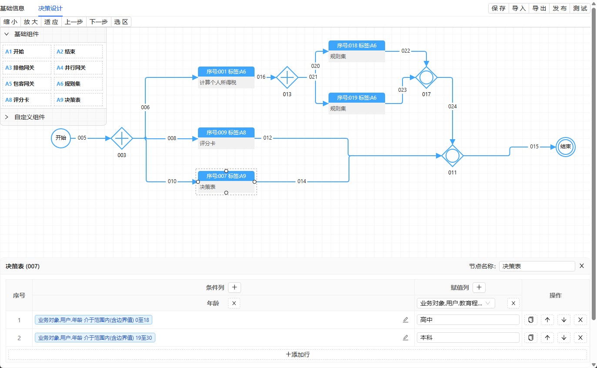

# 规则引擎

这是一个基于Java和Aviator表达式引擎构建的灵活、强大的规则引擎系统。该规则引擎支持复杂规则的定义、组合和执行，可用于业务规则管理、动态决策等场景。

**前端项目地址**：<mcurl name="rule-engine-web" url="https://github.com/threefish/rule-engine-web"></mcurl>

## 项目特点

- **基于Aviator表达式引擎**：高性能的表达式解析和执行
- **灵活的规则定义**：支持多种操作符、组合方式和条件类型
- **流程驱动**：基于流程模型的规则执行流程

## 核心概念

### 规则 (Rule)
规则是规则引擎的基本构建块，包含条件定义和执行逻辑。

- **基本条件**：单个字段的比较操作（等于、大于、小于等）
- **复合条件**：通过AND/OR组合多个子规则
- **支持的操作符**：
  - 比较操作符：`=`、`!=`、`<`、`>`、`<=`、`>=`
  - 字符串操作符：`contains`、`notContains`、`like`、`notLike`、`beginWith`、`endWith`等
  - 集合操作符：`inCollection`、`notInCollection`、`between`、`notBetween`
  - 空值判断：`isNull`、`isNotNull`、`isEmpty`、`isNotEmpty`

### 规则动作 (RuleAction)
规则动作定义了规则满足条件时的行为。

- **条件规则**：定义触发条件的`whenRule`
- **满足动作**：条件满足时执行的`thenActions`
- **不满足动作**：条件不满足时执行的`otherwiseActions`

### 规则集 (RuleSet)
规则集是规则动作的集合，支持批量管理和执行规则。

### 流程模型 (ProcessModel)
流程模型定义了规则引擎的执行流程和节点。

- **起始节点**：流程的入口点
- **结束节点**：流程的终止点
- **业务对象模型**：定义流程中使用的数据模型
- **执行监听器**：监听流程执行事件


### 核心模块

1. **规则引擎核心 (engine)**
   - **aviator**：Aviator表达式执行器和自定义函数
   - **rule**：规则定义和规则动作模型
   - **definition**：流程定义和模型解析
   - **runtime**：流程运行时服务
   - **common**：公共工具和常量

2. **适配器层 (adapter)**
   - 提供与外部系统交互的接口
   - 流程定义和实例的持久化适配

3. **运行时服务**
   - **ProcessRunService**：流程启动和执行的核心服务

### 技术栈

- **Java**：核心开发语言
- **Spring Boot**：应用框架
- **Aviator**：表达式引擎
- **Hutool**：工具库
- **Lombok**：简化Java代码

## 规则引擎工作流程

1. **规则定义**：创建规则对象，设置条件和操作符
2. **规则组合**：通过规则集组织多个规则动作
3. **流程构建**：定义流程模型，包含起始节点和业务对象模型
4. **规则执行**：启动流程实例，执行规则计算
5. **结果处理**：根据规则执行结果执行相应的动作

## 表达式执行

规则引擎使用Aviator表达式引擎来执行规则表达式：

- **自动类型转换**：支持数字、字符串等类型的精确计算
- **缓存机制**：支持表达式缓存，提高性能
- **自定义函数**：可扩展的自定义函数支持
- **上下文管理**：提供表达式执行的上下文环境

## 扩展点

1. **自定义函数**：实现`AviatorFunction`接口，添加自定义表达式函数
2. **执行监听器**：添加流程执行事件监听器
3. **节点行为**：自定义节点执行行为

## 开发指南

### 快速开始

1. **引入依赖**：通过pom.xml引入项目依赖
2. **配置规则引擎**：设置规则引擎相关配置
3. **定义规则**：创建规则对象和规则集
4. **启动流程**：调用`ProcessRunService.start()`方法启动流程实例

### 示例代码

```java
// 创建流程请求
CreateProcessRequest request = new CreateProcessRequest();
request.setKey("myRuleProcess");
request.setVariable(businessVariables);

// 启动流程
ProcessInstance instance = processRunService.start(request);

// 获取执行结果
Map<String, Object> response = instance.getResponse();
```

## 应用场景

- **业务规则管理**：动态配置和管理业务规则
- **智能决策系统**：基于规则的自动决策
- **工作流条件判断**：流程流转的条件控制
- **数据验证**：复杂的数据验证规则
- **动态定价**：基于多维度条件的动态定价策略

## 配置说明

规则引擎支持以下主要配置：

- **表达式计算精度**：通过`AviatorEvaluator`的`Options`设置
- **缓存策略**：控制表达式缓存行为
- **自定义函数扫描**：自动扫描和注册自定义表达式函数

## 注意事项

- 规则表达式应避免使用过于复杂的逻辑，影响执行效率
- 对于大量规则，建议使用规则集进行分组管理
- 合理使用表达式缓存，提高重复表达式的执行效率

## 截图展示

以下是规则引擎的主要功能截图：

### 规则引擎界面


### 规则引擎界面2


### 规则引擎界面3



### 条件构造界面


### 表达式编辑界面


## 联系信息

**作者**：黄川 (huchuc@vip.qq.com)

